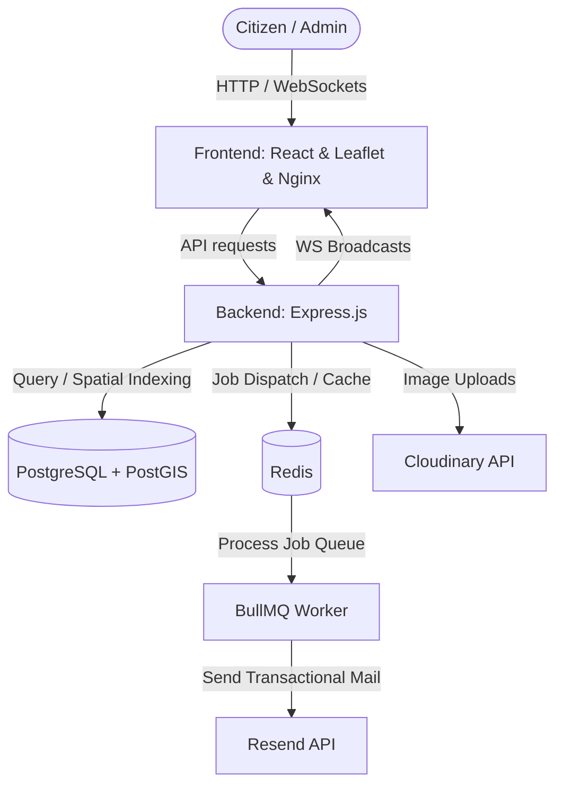

# CivicVoice 🏙️

[](https://opensource.org/licenses/MIT)
[](https://nodejs.org)
[](https://react.dev)
[](https://www.docker.com)

CivicVoice is a modern, interactive, and real-time citizen engagement platform designed to bridge the gap between community members and local municipal administrations. It allows citizens to pinpoint, categorize, and report local infrastructure and utility issues (such as broken roads, water leaks, power outages, and sanitation hazards) directly on a map. Other users in the community can upvote existing issues to indicate their severity, helping administrators prioritize and resolve problems efficiently.

---

## 🏛️ System Architecture

CivicVoice is built as a decoupled, multi-container system orchestrating several specialized components:



### Key Components
1. **Frontend (`civicvoice-client`)**: A Vite-powered React single-page application utilizing Leaflet for spatial map interaction, styled with Tailwind CSS, and served via **Nginx** in production.
2. **Backend**: An Express.js REST API providing secure routing, role-based access control (JWT), and WebSockets (Socket.io) for real-time interface broadcasts.
3. **Database (PostgreSQL + PostGIS)**: Relational database with geographic extensions to support spatial distance indexing and point/location queries.
4. **Cache & Queue (Redis & BullMQ)**:
   - Redis caching for nearby query responses to improve performance.
   - Redis-backed BullMQ message queue to process heavy asynchronous background tasks (such as sending emails and interacting with external APIs).
5. **Services (Cloudinary & Resend)**:
   - Cloudinary manages citizen-uploaded photos of issues.
   - Resend handles email alerts (verification, password resets).

---

## ✨ Core Features

*   📍 **Spatial Mapping (Leaflet & PostGIS)**: Interactive map with automatic geolocation. View, filter, and report issues with custom colored indicators based on category.
*   🚦 **Real-Time Dynamic Updates (Socket.io)**: Live feedback across clients. When a citizen submits a new report, upvotes an issue, or an admin updates a status, the change propagates instantly without page reloads.
*   🔍 **Smart Spam Prevention (ST_DWithin Check)**: Automatically checks for nearby duplicates of the same category within a 200-meter radius before inserting a new issue, prompting the user to upvote the existing report instead.
*   📊 **Administrative Control Board**: Role-based access control. Admins can view complete issue tables, transition statuses (`Open` ➡️ `In Progress` ➡️ `Resolved`), and trace issue metrics.
*   📬 **Asynchronous Queue Jobs**: Background worker processes user verification mails and password resets asynchronously via BullMQ, keeping HTTP request loops fast and resilient.
*   📱 **Responsive Mobile Experience**: Tailored user interface featuring custom sliding bottom sheets on mobile devices and responsive grid layouts.

---

## 📁 Repository Structure

```tree
CivicVoice/
├── civicvoice-client/       # Frontend Application (React + Vite)
│   ├── src/
│   │   ├── api/             # API request wrappers
│   │   ├── components/      # Common UI elements (Navbar, ProtectedRoute)
│   │   ├── context/         # AuthContext state provider
│   │   ├── hooks/           # useSocket, etc.
│   │   └── pages/           # Landing, Map, Report, Admin, Auth pages
│   ├── Dockerfile           # Multi-stage production build (Node -> Nginx)
│   └── nginx.conf           # Production Nginx reverse-proxy configuration
├── src/                     # Backend API Application (Express.js)
│   ├── config/              # Cloudinary and environment setups
│   ├── db/                  # PostgreSQL client & schema migration script
│   ├── middleware/          # JWT Auth, Admin checks, error handlers
│   ├── queues/              # BullMQ Redis worker configuration
│   ├── routes/              # Express Router files (auth, issues)
│   ├── utils/               # Helper utilities (Cloudinary, Resend senders)
│   ├── app.js               # Express application setup
│   └── socket.js            # Socket.io connection coordinator
├── Dockerfile               # Production Node backend Docker image
├── docker-compose.yml       # Production/Local orchestrator
└── nginx.conf               # Root-level Nginx config
```

---

## 🗄️ Database Schema

The database uses PostgreSQL extended with **PostGIS** for spatial data structures. Below is the simplified relational schema:

```
                  ┌────────────────────────────┐
                  │           users            │
                  ├────────────────────────────┤
                  │ id (PK)                    │◄──────┐
                  │ name                       │       │
                  │ email (Unique)             │       │
                  │ password                   │       │
                  │ role (citizen/admin)       │       │
                  │ is_verified (bool)         │       │
                  │ verification_token         │       │
                  └────────────────────────────┘       │
                             │                   │
                             │ 1:N               │ 1:N
                             ▼                   │
                  ┌────────────────────────────┐       │
                  │           issues           │       │
                  ├────────────────────────────┤       │
                  │ id (PK)                    │◄──┐   │
                  │ title                      │   │   │
                  │ description                │   │   │
                  │ category (Enum)            │   │   │
                  │ status (Enum)              │   │   │
                  │ location (GEOGRAPHY)       │   │   │
                  │ address                    │   │   │
                  │ user_id (FK) ──────────────┼───┼───┘
                  │ image_url                  │   │
                  └────────────────────────────┘   │
                             │                     │
                             │ 1:N                 │ 1:N
                             ▼                     │
                  ┌────────────────────────────┐   │
                  │       issue_upvotes        │   │
                  ├────────────────────────────┤   │
                  │ user_id (FK) ──────────────┼───┘
                  │ issue_id (FK) ─────────────┼───┘
                  │ (Composite PK)             │
                  └────────────────────────────┘
```

---

## ⚙️ Environment Configuration

You must configure environment variables to run the application. Create `.env` files matching the structures below:

### Backend Environment (`.env` in project root)

| Variable | Description |
| :--- | :--- |
| `PORT` | Backend server port (default: `5000`) |
| `DATABASE_URL` | PostgreSQL connection string |
| `JWT_SECRET` | Secret key for signing JWT tokens |
| `REDIS_HOST` / `REDIS_PORT` / `REDIS_URL` | Redis connection details |
| `POSTGRES_USER` / `POSTGRES_PASSWORD` / `POSTGRES_DB` | PostgreSQL credentials (used by Docker Compose) |
| `CLOUDINARY_CLOUD_NAME` / `CLOUDINARY_API_KEY` / `CLOUDINARY_API_SECRET` | Cloudinary image upload credentials |
| `RESEND_API_KEY` / `FROM_EMAIL` | Resend transactional email service credentials |
| `APP_URL` / `FRONTEND_URL` | Public URLs used in email links and CORS |

### Frontend Environment (`civicvoice-client/.env`)
```env
VITE_API_URL=http://localhost:5000/api
VITE_SOCKET_URL=http://localhost:5000
```

---

## 🚀 Getting Started

### Option A: Local Development Setup

#### Prerequisites
*   **Node.js** v20.x or higher
*   **PostgreSQL** (v15+) with **PostGIS** extension enabled
*   **Redis** (v7.x+) running locally

#### Step 1: Clone and Install Dependencies
```bash
# Clone the repository
git clone https://github.com/Sambhav-gg/CivicVoice.git
cd CivicVoice

# Install backend dependencies
npm install

# Install frontend dependencies
cd civicvoice-client
npm install
cd ..
```

#### Step 2: Set up Database Schema
Connect to your local PostgreSQL database and initialize the tables:
```bash
psql -U your_postgres_user -d your_database_name -f src/db/schema.sql
```

#### Step 3: Run Services
Start the backend Express API server and the background BullMQ worker process:
```bash
# Start backend (from root folder)
npm run dev
```

Start the frontend Vite development server:
```bash
# Start client (from civicvoice-client folder)
cd civicvoice-client
npm run dev
```
Open [http://localhost:5173](http://localhost:5173) in your browser.

---

### Option B: Docker Compose Setup (Recommended)

To run the entire ecosystem (Nginx Frontend, Node Backend, PostgreSQL Database with PostGIS, and Redis Cache/Queue) in containerized isolation:

#### Running the Stack
From the root directory, simply run:
```bash
docker-compose up --build
```

#### Container Networking Architecture
*   **Postgres Container (`civicvoice-postgres`)**: Initializes database automatically via the mapped sql initialization script `./src/db/schema.sql`. Exposed on port `5432`.
*   **Redis Container (`civicvoice-redis`)**: Provides key-value cache and job queues on port `6379`.
*   **Backend Container (`civicvoice-backend`)**: Serves Express API & coordinates Socket.io. Mapped internally to port `5000`.
*   **Frontend Container (`civicvoice-frontend`)**: Builds React bundle, sets up production Nginx configs, reverse-proxies `/api` and `/socket.io` matching backend definitions. Exposed to localhost on port `8080`.

To view the app, visit: [http://localhost:8080](http://localhost:8080).

---

## 🔌 API Routes Reference

### Authentication

| Method | Endpoint | Description | Auth Required |
| :--- | :--- | :--- | :---: |
| **POST** | `/api/auth/register` | Register a new citizen account | No |
| **POST** | `/api/auth/login` | Login and receive a session JWT | No |
| **GET** | `/api/auth/verify` | Verify email via activation token (redirects to frontend) | No |
| **POST** | `/api/auth/resend-verification` | Resend the verification email | No |
| **GET** | `/api/auth/me` | Get the authenticated user's profile | Yes |
| **POST** | `/api/auth/forgot-password` | Request a password reset link | No |
| **POST** | `/api/auth/reset-password` | Reset password using a valid token | No |

### Issues

| Method | Endpoint | Description | Auth Required |
| :--- | :--- | :--- | :---: |
| **POST** | `/api/issues` | Report a new issue (supports image upload) | No |
| **GET** | `/api/issues` | Fetch paginated, filterable issue list (cursor-based) | No |
| **GET** | `/api/issues/nearby` | Spatial query by coordinates and radius (Redis cached) | No |
| **GET** | `/api/issues/my-votes` | Get list of issue IDs the authenticated user has upvoted | Yes |
| **PATCH** | `/api/issues/:id/upvote` | Upvote an issue (fires milestone notifications at 10/50/100) | Yes |
| **PATCH** | `/api/issues/:id/status` | Update issue status (`open`, `in_progress`, `resolved`) | **Admin Only** |

---

## 📄 License

This project is licensed under the MIT License.
